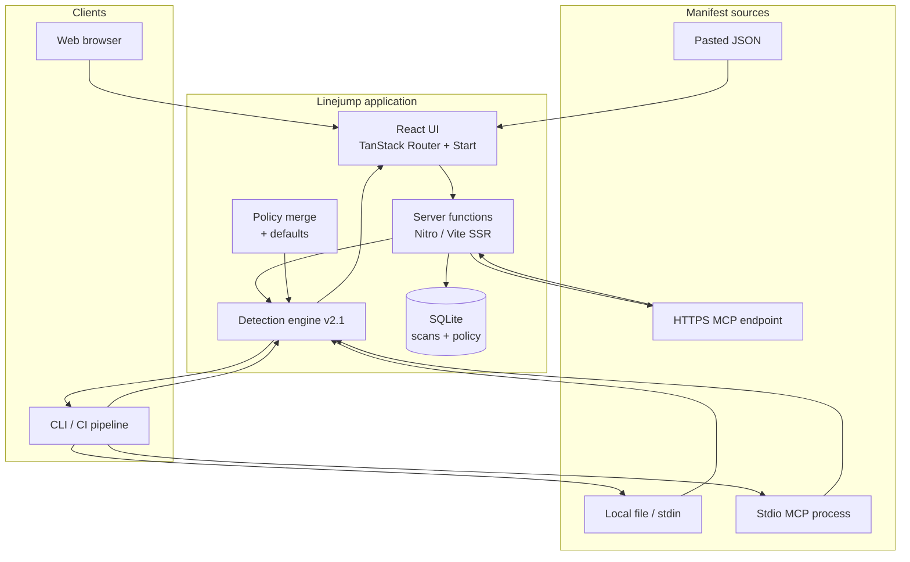

# Linejump — MCP security, pre-flight

**Audit every MCP server before it reaches your model.**

Linejump is a static security scanner for Model Context Protocol (MCP) servers. It analyzes manifests, tool descriptions, input schemas, prompts, and resources for prompt injection, obfuscation, over-broad capabilities, and cross-tool attack paths — before any connection is made. Results export as PDF, SARIF, or JSON for CI and security review workflows.

---

## Key features

- **Forensic manifest scanning** — tools, schemas, prompts, resources, and server instructions
- **Detection engine v2.1** — 40+ rules with stable IDs, confidence scoring, and split-field bypass detection
- **Live HTTP fetch** — `tools/list` over HTTPS with SSRF guards
- **CLI + stdio** — scan local files, stdin, stdio MCP servers, and Cursor/Claude MCP configs
- **ATLAS map** — visual attack-landscape grid of findings by category
- **Policy as code** — disable rules, override severity, block capabilities, custom regexes
- **Scan history & diff** — compare two scans side-by-side
- **Exports** — SARIF 2.1.0 (GitHub/GitLab CI), PDF reports, JSON
- **CI mode** — threshold gates with exit codes for pipelines

---

## System architecture

<p align="center"><strong>Figure 1 — Linejump system architecture</strong></p>



### Flow-by-flow explanation

1. **Web scan (paste)** — User pastes manifest JSON in the scanner. The browser calls `scanManifest` via TanStack Start server functions. Policy is loaded from SQLite, merged with defaults, and passed to the detection engine. Results render in the UI with ATLAS map, findings list, and safety score.

2. **Web scan (live URL)** — User enters an HTTPS URL. The server fetches JSON (GET) or POSTs MCP `tools/list`, with SSRF blocking for private IPs. The response is normalized to a manifest, scanned, signed, and stored in scan history.

3. **CLI file / stdin** — `npm run scan -- ./manifest.json` or pipe JSON to stdin. Policy loads from SQLite (if present) or `--policy` JSON. Output is terminal report, `--json`, `--sarif`, or `--ci` markdown.

4. **CLI stdio MCP** — `--stdio` or `--mcp-config` spawns a local MCP server, runs initialize + `tools/list`, builds a manifest, and scans it. Required for local servers the web UI cannot spawn.

5. **Policy enforcement** — Before scoring, findings are filtered (`disabledRules`), severity-overridden, and capability-block escalations applied. Default overrides reduce noise on standard MCP tool patterns.

6. **Persistence** — Each web scan is saved to SQLite with manifest, report JSON, and scan ID. History page supports selecting two scans for diff view.

7. **Export** — SARIF for code-scanning platforms; PDF for human review; signed report metadata stored server-side.

---

## Tech stack

| Layer | Technology |
|-------|------------|
| Frontend | React 19, TanStack Router, TanStack Start, Motion |
| Styling | Tailwind CSS 4, Radix UI, shadcn/ui |
| Backend | TanStack Start server functions, Nitro |
| Database | better-sqlite3 (SQLite) |
| Scanner | TypeScript detection engine (deterministic rules) |
| CLI | tsx, Node child_process (stdio MCP) |
| Build | Vite 7, TypeScript 5 |
| Container | Docker / docker-compose (Bun runtime) |
| Testing | Vitest |

---

## Setup

### Prerequisites

- **Node.js** 20+ (22 recommended)
- **npm** 10+
- Optional: **Docker** for containerized deploy

### Local development

```bash
git clone https://github.com/ritvikindupuri/LineJump.git
cd LineJump
npm install
npm run dev
```

Open **http://localhost:8080** (Vite dev port).

### Production build

```bash
npm run build
npm run preview
```

### Docker

```bash
docker compose up --build
```

App serves on **http://localhost:3000**.

### Environment variables

Copy the example file (optional — scanner runs without AI keys):

```bash
cp .env.example .env
```

| Variable | Purpose |
|----------|---------|
| `ANTHROPIC_API_KEY` | Reserved for future features (not required for scanning) |
| `CLAUDE_MODEL` | Model identifier placeholder |

### Run tests

```bash
npm test
```

---

## How to use the app

### Landing page (`/`)

1. Open **http://localhost:8080**
2. Read the product overview and three-step diagram
3. Click **Open scanner** or **Run a scan** to go to `/app`

### Scanner (`/app`)

#### Option A — Paste a manifest

1. Navigate to **Scanner** (header link or landing CTA)
2. In the large text area, paste MCP JSON (manifest, `tools/list` response, or tool array)
3. Click **Run scan** (bottom-right of text area)
4. Wait for the report panel on the right

#### Option B — Fetch a live server

1. In the URL bar at the top, enter an **HTTPS** MCP endpoint (e.g. `https://your-server.example.com/mcp`)
2. Click **Fetch & scan**
3. The manifest populates the text area and the scan runs automatically

#### Reading results

1. **Safety score** (top-right) — hover for tooltip explaining `/100`
2. **Severity badges** — count of critical / high / medium / low / info
3. **ATLAS map** — grid of finding categories; hover a zone for titles
4. **Findings list** — scrollable cards with severity, category, rule ID, confidence, location, evidence
5. **Download SARIF** — export for GitHub/GitLab code scanning
6. **Download PDF** — human-readable report

#### Header navigation

- **History** — past scans
- **Policy** — org rule configuration
- **Back** — return to landing page

### Policy (`/policy`)

1. Click **Policy** in the scanner header
2. **Blocked Capabilities** — comma-separated keywords that escalate to critical
3. **Disabled Rules** — comma-separated rule IDs to ignore (see [Rule Catalog](./docs/rule-catalog.md))
4. Click **Save Policy**
5. Return to scanner and re-run — new policy applies immediately

### History (`/history`)

1. Click **History** in the header
2. View list of past scans with score and timestamp
3. Click two scan rows to select them (checkbox)
4. Click **Compare Selected** to open the diff view

### Diff (`/diff`)

1. Opens automatically from History with `?id1=` and `?id2=` query params
2. Side-by-side findings from two scans
3. Click **Back to History** to return

### CLI usage

```bash
# File
npm run scan -- ./manifest.json

# Stdin
cat manifest.json | npm run scan -- -

# Stdio MCP server
npm run scan -- --stdio "npx -y @modelcontextprotocol/server-filesystem /tmp"

# MCP config (Cursor / Claude Desktop style)
npm run scan -- --mcp-config ~/.cursor/mcp.json --server filesystem

# SARIF for CI
npm run scan -- ./manifest.json --sarif results.sarif.json

# CI gate (exit 1 on failure)
npm run scan -- ./manifest.json --ci --max-critical=0 --max-high=0 --min-score=70
```

---

## Documentation

| Document | Description |
|----------|-------------|
| [Technical Documentation](./docs/TECHNICAL_DOCUMENTATION.md) | Full system design, features, and architecture |
| [Rule Catalog](./docs/rule-catalog.md) | All detection rule IDs |
| [Tuning Guide](./docs/tuning-guide.md) | Policy configuration for enterprises |

---

## License

See repository for license details.

**Repository:** https://github.com/ritvikindupuri/LineJump
