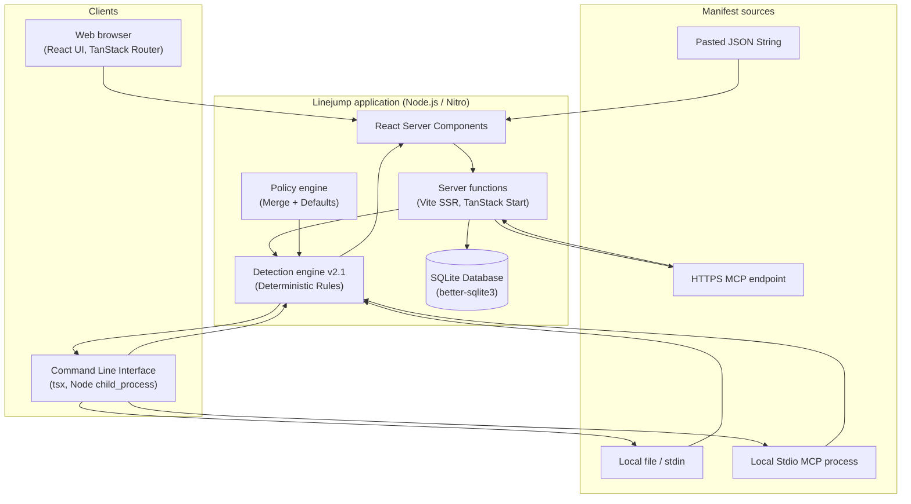
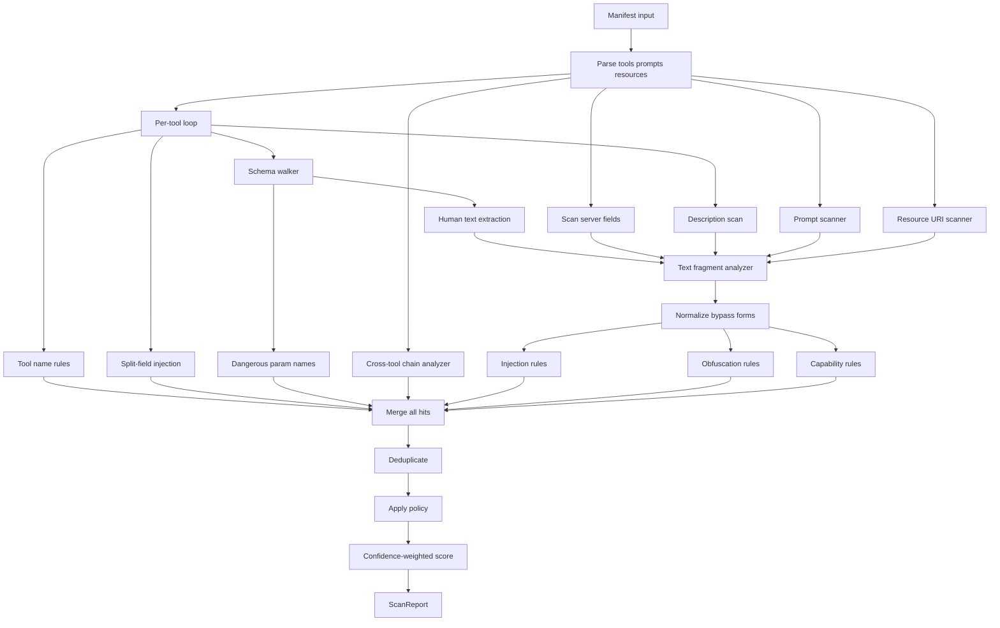

# Linejump — Technical Documentation

**By:** Ritvik Indupuri  
**Date:** Jun 18, 2026

---

## Table of contents

1. [Executive summary](#executive-summary)
2. [Product scope](#product-scope)
3. [System architecture](#system-architecture)
4. [Detection engine architecture](#detection-engine-architecture)
5. [Core features](#core-features)
6. [Data model and persistence](#data-model-and-persistence)
7. [API and server functions](#api-and-server-functions)
8. [CLI and transports](#cli-and-transports)
9. [Policy system](#policy-system)
10. [Scoring model](#scoring-model)
11. [Export formats](#export-formats)
12. [CI integration](#ci-integration)
13. [Security considerations](#security-considerations)
14. [Deployment](#deployment)
15. [Testing](#testing)
16. [Conclusion](#conclusion)

---

## Executive summary

Linejump is a **pre-flight static analysis platform** built to secure Model Context Protocol (MCP) servers. Organizations deploy Linejump to preemptively audit tool manifests, descriptions, input schemas, server prompts, and resource URIs *before* those definitions reach an LLM's context window or are exposed to production agent pipelines.

Unlike runtime MCP proxies which rely on dynamic fuzzing or interception during runtime invocation, Linejump operates deterministically on **declared metadata** — inspecting the precise surface area a model relies on when deciding whether or how to select tools.

Powered by the highly-optimized **Detection Engine v2.1.0**, Linejump applies over 40 precise rules to detect prompt injection phrases, text obfuscation attacks (such as homoglyphs, invisible zero-width characters, HTML entities, ANSI escapes), over-broad administrative or sensitive capabilities, dangerous schema fields, and complex cross-tool exfiltration chain risks. Findings yield highly stable rule IDs, which integrates into a robust enterprise policy tuning mechanism.

The Linejump ecosystem comprises a **Web Scanner UI** (using React 19, TanStack Router, and TanStack Start), a powerful headless **CLI** designed for seamless CI/CD pipeline integration and local stdio MCP server spawning, and a highly performant **SQLite-backed data layer** managing scan history storage, side-by-side diffing, and enterprise policy persistency. Export mechanisms ensure compatibility across standard audit formats, including **SARIF 2.1.0** for automated code scanning and **PDF** for manual human reviews.

Importantly, Linejump does **not** rely on slow, non-deterministic autonomous LLM agents to detect vulnerabilities. The engine is entirely rule-based, reproducible, statically verifiable, and capable of operating entirely offline without exposing proprietary manifests to third-party endpoints.

---

## Product scope

### In scope

Linejump natively analyzes and detects risks within the following domains:

| Capability | Description |
|------------|-------------|
| **Static manifest analysis** | Full recursive scanning of tool names, descriptions, and JSON input schemas (`additionalProperties`, combinations like `oneOf`/`anyOf`/`allOf`, and nested property hierarchies). |
| **Prompt & resource scanning** | Full surface coverage for the MCP `prompts` array (and associated text blocks) and the `resources` definitions (verifying sensitive remote endpoints and local filesystem traversal paths). |
| **Server-level fields** | Deep heuristic inspection of high-level fields like `instructions`, `systemPrompt`, `serverInfo`, `readme`, and `documentation`. |
| **Live HTTPS fetch** | Automated manifest resolution via GET requests to standard JSON locations, falling back to the JSON-RPC `tools/list` over Server-Sent Events (SSE) parsing. |
| **Local / stdio MCP spawn** | Deep CLI integration invoking subprocesses and performing standard MCP JSON-RPC handshakes (e.g. `initialize`, `notifications/initialized`, `tools/list`) natively. |
| **Policy per organization** | Broad override control system offering rule disablement, per-rule severity overrides, custom regular expressions, and capability-based blocking. |
| **Scan history & diff UI** | Granular persistence tracking in SQLite with historical diff views to monitor server degradation or improvements across deployments. |
| **SARIF / PDF / JSON export** | Native integrations ensuring findings are output into the precise schemas needed by code scanning systems, pipeline automation, or auditing managers. |

### Out of scope (current version)

| Capability | Notes |
|------------|-------|
| **Runtime tool execution** | Linejump performs no dynamic tool invocation, fuzzing of input APIs during runtime, or real-time proxy traffic analysis. |
| **LLM semantic analysis** | Detections are built around highly tuned regular expressions, text normalizations, and heuristic patterns; external AI API calls for semantic classification are actively omitted. |
| **Multi-tenant auth / SSO** | The current instance is scoped to a single `default_org` and does not yet handle enterprise RBAC, SAML, or SSO boundaries. |
| **Web stdio spawn** | Web-based browsers cannot securely or architecturally spawn arbitrary local backend binaries; stdio execution is isolated to the CLI context. |
| **Fleet-wide dashboard** | The underlying SQLite database is tightly scoped to the single host. A distributed Postgres or centralized fleet data aggregator is not natively supplied in the current open-source core. |

---

## System architecture

<p align="center"><strong>Figure 1 — Linejump system architecture</strong></p>



### Flow-by-flow explanation

Linejump employs multiple ingress routes and execution pathways depending on the operational context. Below are the precise technical flows for the fundamental architectural behaviors:

1. **Web scan (Paste mechanism)**
   - **Input:** A user directly pastes an MCP JSON payload (a complete manifest, a `tools/list` RPC response, or just an array of tools) into the React front-end text area on `/app`.
   - **Normalization:** The browser triggers the `scanManifest` server function via TanStack Start over RPC. The server uses `parseManifestInput` (in `src/lib/mcp-scanner.ts`) to validate the string as JSON and flexibly unwrap nested structures (e.g., standardizing an array of tools or stripping out `result.tools` wrappers) to generate a canonical `McpManifest` object.
   - **Policy Merging:** The system invokes `fetchPolicy` to query the SQLite backend (`linejump.sqlite`) for the `default_org`'s `ScannerPolicy`. The `mergePolicy` utility then natively shallow-merges the organization's settings (disabled rules, severity overrides, custom regexes) onto the `DEFAULT_SCANNER_POLICY`.
   - **Scanning:** The `runDetectionEngine` takes the normalized manifest and the merged policy. It recursively walks every field of the manifest, building a list of findings and calculating a weighted confidence penalty score.
   - **Attestation & Persistence:** Finally, `generateSignedReport` uses an RSA-SHA256 mechanism to cryptographically sign the result. It generates a unique random UUID, saves the raw input manifest, report JSON, and timestamp to the `scans` table in SQLite, and returns the response back to the client.
   - **Rendering:** The React application re-hydrates, rendering the safety score out of 100, constructing the ATLAS attack-landscape map component, and displaying individual finding cards.

2. **Web scan (Live URL fetch)**
   - **Input:** The user types an `https://` endpoint into the URL bar and submits.
   - **Verification & Execution:** The `fetchMcpManifest` server function (`src/lib/mcp-fetch.functions.ts`) intercepts the request. It blocks `http://` schemes, `localhost`, and internal IPv4 network blocks (preventing Server-Side Request Forgery vulnerabilities).
   - **Network Resolution:** It attempts a standard `GET` request. If the response content-type is strictly JSON, it parses it directly. If the endpoint responds as an MCP Server (using SSE streams), Linejump dynamically falls back to an RPC query POSTing a `{"method": "tools/list"}` payload and parses the returned JSON-RPC stream.
   - **Conclusion:** The retrieved valid JSON string is passed to `parseManifestInput`, flowing back into the identical Normalization, Policy Merging, Scanning, and Persistence steps executed in a Paste context.

3. **CLI execution (File or stdin)**
   - **Input:** A user invokes `npm run scan -- ./manifest.json` or pipes standard input `cat file.json | npm run scan -- -`.
   - **Loading:** The CLI script (`cli/scan.ts`) reads the file directly via `fs.readFileSync` into memory.
   - **Policy & Evaluation:** It accesses the policy logic directly from SQLite or dynamically overrides it using `--policy ./policy.json`. It instantiates the detection engine, calculates the results directly in the Node.js runtime process (bypassing TanStack Start RPC overhead entirely), and constructs the final output format.
   - **Formatting:** Findings are optionally reformatted natively into terminal tables, written to a SARIF 2.1.0 file (`--sarif`), or dumped to JSON (`--json`).

4. **CLI execution (Stdio spawn)**
   - **Input:** User invokes the CLI with `--stdio "npx -y @modelcontextprotocol/server-filesystem /tmp"`.
   - **Process Spawn:** The `mcp-stdio.ts` utility breaks apart the command and spawns a native Node.js `child_process.spawn()`.
   - **Handshake Protocol:** Linejump orchestrates a raw JSON-RPC state machine over standard input/output streams. It posts an `initialize` JSON-RPC message, waits for the server response, asserts `notifications/initialized`, and issues the core `tools/list` command.
   - **Teardown & Analysis:** It parses the JSON Line streams from stdout, buffers the response into a consolidated manifest JSON structure, automatically kills the underlying child process to prevent resource leaks, and pushes the payload directly into the Detection Engine.

5. **Diff and Scan History comparison**
   - **Selection:** Within the React `/history` route, the application retrieves all stored database entries. Selecting two discrete scans passes their associated UUIDs to the `/diff` route (`?id1=&id2=`).
   - **Evaluation:** The server pulls both persisted JSON manifest states, runs a deep visual property check, and renders a side-by-side comparative UI to highlight regressions, resolved errors, or newly introduced capabilities.

---

## Detection engine architecture

<p align="center"><strong>Figure 2 — Detection engine pipeline</strong></p>



### 1. Normalization Layer
The core detection heuristic relies strictly on the `src/lib/detection/normalize.ts` service. Before any regular expression evaluation executes, raw input text undergoes rigorous mutations to defeat standard obfuscation and prompt-injection bypass forms. Transformations include:
- **Unicode NFKC normalization:** To handle strange encodings correctly.
- **Homoglyph folding:** Collapsing Cyrillic lookalikes back to their Latin counterparts (`a` vs `а`).
- **Leetspeak expansion:** Transliterating standard substitutions (e.g. `!gn0re` -> `ignore`).
- **Punctuation stripping and Spaced-letter collapse:** Defeating simple obfuscation strategies like `i g n o r e` dynamically translating back to `ignore`.

### 2. Deep Text Fragment Analysis
Text is evaluated by `scanTextFragment()` (`engine.ts`), breaking the text up to identify exact string matches or RegEx rules defining capabilities.
It detects sophisticated obfuscation: Zero-width overrides (`\u200B`), invisible control characters, hidden ANSI escapes, hidden HTML comments/entities, Base64 embedded strings, and escaped character structures.

### 3. Split-field Injection Detection
Adversaries intentionally circumvent conventional static rules by breaking injection statements in half across discrete fields (e.g. splitting `ignore previous` such that `"ignore "` is the tool description, and `"previous"` is the schema title). Linejump executes a deep `scanSplitFieldInjection` mapping loop that structurally concatenates schemas and descriptions together securely to identify advanced evasion attempts.

### 4. Cross-tool Chain Modeling
Linejump actively inspects the manifest to determine structural attack pathways that do not technically exist on an isolated tool level. `scanCrossTool()` maps tools dynamically, detecting when combinations enable severe exploits — for instance, highlighting a "Cross-tool exfiltration path" if one tool features `filesystem_read` heuristics and another provides `network_out` webhooks.

### 5. Rule Weighting and Deduplication
Findings are passed through an intelligent `dedupeFindings()` logic layer that squashes identical rules triggered multiple times for the exact same tool and evidence context. The system then merges policy decisions directly onto the payload, upgrading/downgrading severities and filtering skipped rules, before executing the confidence-multiplier scoring system (`computeScore`).

---

## Core features

### 1. Web scanner (`/app`)
- **Dual execution paths:** Accepts raw JSON pasted text or fetches directly from Live HTTPS server endpoints dynamically.
- **Immediate processing:** Operates entirely locally within the server component; does not rely on third-party API dependencies.
- **ATLAS Attack Map (`src/components/atlas-map.tsx`):** A custom visual matrix grid automatically grouping findings by categorical attack surface domains.
- **Rich finding cards:** Displays specific rule IDs, mapped confidence multipliers, and direct string evidence excerpts targeting exactly where a finding triggered.
- **Native Exports:** Immediate downloads available for both SARIF formats and PDF generation post-scan.

### 2. Live MCP HTTP fetch
Function (`src/lib/mcp-fetch.functions.ts`):
1. **SSRF Guarding:** Performs DNS / IP regex checks blocking internal `127.0.0.1`, `10.x.x.x`, `192.168.x.x` blocks.
2. **Payload Fetching:** Performs a raw `GET` HTTP fetch.
3. **RPC Event Parsing:** Automatically parses line-delimited Server Sent Events payload responses if the server implements dynamic SSE `tools/list` behaviors.
4. Returns the validated JSON payload into the main pipeline.

### 3. Detection engine
40+ rigid heuristic and deterministic rule IDs handling obfuscation, privilege escalation limits, schema parsing structures (including validating combinations like `oneOf`/`anyOf`), and robust prompt injection strategies. Includes a complex `LEGIT_TOOL_NAME_RE` mapping protocol to purposefully silence false positives on inherently sensitive but broadly accepted tool titles (like `read_file`).

### 4. Policy system
- **`disabledRules`:** An array of exact strings identifying specific rule IDs to purposefully omit.
- **`severityOverrides`:** Mapping system elevating or silencing rules natively (e.g. promoting `medium` to `critical`).
- **`blockedCapabilities`:** An enterprise string array that instantly escalates any rule text matches involving specific behaviors up to absolute `critical` blockers (e.g. blocking the capability `outbound network access`).
- **`customRegexes`:** Custom internal validation definitions created per organization.
Defaults operate dynamically in `src/lib/default-policy.ts`.

### 5. Scan history & Diff View
- Automatically manages UUID tracking within the `scans` table (schema housing `server_url`, `manifest_json`, and serialized `report_json`).
- Enables side-by-side UI views allowing direct visual comparison parsing via the `/history` & `/diff` routes to quickly identify delta shifts across deployments.

### 6. Drift Governance & AI Audit Console
- **Drift Detection Heuristics**: Compares active scanned tool schemas and parameters against the organization's signed history in SQLite `manifest_approvals`.
- **Autonomous Audit Agent**: Integrates a Gemini-powered autonomous security auditor that evaluates structural changes side-by-side for prompt injection vectors or capability escalation, and prints real-time reasoning logs.
- **Reviewer Verdict Actions**: Supports explicit `approved` and `denied` states:
  - **Approve**: Signs off on the manifest with the agent's proposed key scheme, updates dashboard status to green `Authorized Matches Approval`, and establishes a visual synchronized connection.
  - **Deny**: Rejects changes, stores a `denied` status in the database, sets dashboard status to red `Rejected / Denied`, and breaks the visual sync flow with a red warning link.
- **Signed Approvals Trail**: Retains a sequentially ordered list of all historical approvals and denials, decorated with green `Signed` and red `Denied` badges for audit compliance.

### 7. Attestation
The engine cryptographically validates the final output using RSA-SHA256 digital signing (`src/lib/attestation.ts`). Signatures utilize randomly generated ephemeral keys locally, allowing organizations to substitute custom external KMS infrastructures in true enterprise scenarios.

---

## Data model and persistence

Linejump natively leverages `better-sqlite3` to interface with the local database instance `linejump.sqlite`.

### Core Schemas

**Table: `orgs`**

| Column | Type | Description |
|--------|------|-------------|
| id | TEXT PK | Internal organization identifier (`default_org` natively) |
| name | TEXT | Rendered display name |

**Table: `policies`**

| Column | Type | Description |
|--------|------|-------------|
| org_id | TEXT PK | Foreign Key relationship to the `orgs` table |
| config_json | TEXT | Deeply serialized `ScannerPolicy` JSON string object |

**Table: `scans`**

| Column | Type | Description |
|--------|------|-------------|
| id | TEXT PK | A unique universally unique string for referencing scans |
| org_id | TEXT | Foreign Key identifying ownership scope |
| server_url | TEXT | Optional string identifying source derivation if captured over HTTPS |
| manifest_json | TEXT | The raw input structure natively preserved in memory |
| report_json | TEXT | Full serialized `ScanReport` object detailing scoring and findings |
| created_at | DATETIME | Absolute record timestamp |

---

## API and server functions

Linejump handles all data mutations locally via robust TanStack Start / Nitro server functions:

| Function | File | Invocation | Detailed Purpose |
|----------|------|--------|---------|
| `fetchMcpManifest` | `mcp-fetch.functions.ts` | POST | Exclusively executes network fetching for dynamic web scan HTTPS manifests, managing SSRF verification. |
| `fetchPolicy` | `policy.functions.ts` | GET | Reads current configuration maps out of SQLite and parses them for standard policy merging limits. |
| `savePolicyFn` | `policy.functions.ts` | POST | Executes raw parameterized `UPDATE/INSERT` statements into SQLite `policies`. |
| `generateSignedReport` | `attestation.functions.ts` | POST | Generates an RSA PKCS1 structure, hashes the stringified report context, and persists the entity fully within SQLite. |
| `fetchHistory` | `db.functions.ts` | GET | Fetches time-sorted metadata chunks to fulfill history pagination rendering. |
| `fetchScan` | `db.functions.ts` | GET | Retrieves an absolute raw database entity for diffing or specific historical context display. |

---

## CLI and transports

Linejump provides robust native CLI capabilities built with `tsx` to interact with highly varied local ecosystems:

| Transport | Implementation Context | Web Support | CLI Support |
|-----------|------------------------|-------------|-------------|
| **Pasted JSON** | Orchestrated natively via `parseManifestInput`. | ✓ | ✓ |
| **HTTPS URL** | Parsed directly via standard `fetch` APIs inside `fetchMcpManifest`. | ✓ | ✓ |
| **Local file** | Ingested via native `fs.readFileSync` file streams natively bypassing web APIs. | — | ✓ |
| **Standard input** | Evaluated continuously via `-` piped directly to `process.stdin`. | — | ✓ |
| **Stdio MCP** | Handshakes orchestrated via `child_process.spawn()` streams (`mcp-stdio.ts`). | — | ✓ |
| **MCP config JSON** | Dynamic retrieval of standard `mcp.json` context settings (Cursor/Claude format) using the `--mcp-config` switch logic. | — | ✓ |

### Stdio Handshake Deep Dive (`mcp-stdio.ts`)
1. Spawns standard OS native background process evaluating raw arbitrary command string.
2. Posts `{"jsonrpc":"2.0", "id":1, "method":"initialize", "params":{...}}` string directly to `stdin`.
3. Buffers and parses valid JSON return values.
4. Responds identically with the required `"notifications/initialized"` structural pattern.
5. Issues core standard `"tools/list"` query over standard RPC formats.
6. Awaits, parses line-by-line responses, cleans the buffers, then natively executes process termination to exit successfully.

---

## Policy system

Policies guarantee enterprise noise-reduction against the core highly strict detection configurations.

The structural evaluation relies exclusively on the `mergePolicy` helper in `src/lib/mcp-scanner.ts`. Deep inheritance merges behavior dynamically across the core standard:
1. `DEFAULT_SCANNER_POLICY` establishes standard baseline operating modes.
2. Overrides load sequentially from the SQLite Database (for web invocations) or static `policy.json` (for CLI executions).
3. The `severityOverrides` logic explicitly relies on string-shallow merges to overwrite specific individual target rules directly.
4. Custom overrides and capabilities immediately block scoring processing, applying a localized override flag (`requireApproval` controls internal tracking behavior).

Refer to the formal [Tuning Guide](./tuning-guide.md) for deeply structured enterprise scenarios.

---

## Scoring model

Scoring provides a strict quantitative analysis using dynamic confidence weighting thresholds to minimize false positive volatility.

```
penalty = Σ (SEVERITY_WEIGHT[sev] × CONFIDENCE_MULTIPLIER[conf])
score = clamp(100 - penalty, 0, 100)
```

**Mechanics:**
- Deduplication runs specifically against exact discrete combinations of unique `(toolName, ruleId, location, evidence)` parameters. Identical recurring structural bugs in an isolated tool apply a scoring penalty exactly **once**.
- Rule triggers calculate `severity` mapped to core values (`critical: 30`, `high: 15`, `medium: 6`, `low: 2`, `info: 0`).
- This penalty natively multiplies dynamically against evaluated heuristics defining exactly how confident the engine views the violation (`high: 1`, `medium: 0.75`, `low: 0.45`).
- Total evaluated deductions deduct mathematically from a perfect 100 limit scale baseline (Minimum cap is 0).

---

## Export formats

### SARIF 2.1.0
- Built extensively relying on `src/lib/sarif.ts`.
- Evaluates completely valid structurally to the Standard format specification (`Static Analysis Results Interchange Format`).
- Incorporates dynamic severity mapping rules: `critical/high` maps inherently to `error` limits. `medium` natively exports as `warning`, and lower limits cascade to standard `note` definitions.
- Immediately compliant natively against standard GitHub / GitLab Advanced Security uploading patterns.

### PDF
- Operates strictly locally within the front-end environment via `jsPDF`.
- Embeds specific Server details, scan UUID tracking limits, safety totals natively formatted over dynamic canvas generations, logging exact textual representations of the topmost 20 evaluated findings correctly.

### JSON
- Exports exact raw native JSON outputs derived from the core `ScanReport` TypeScript interface limits directly covering deep metrics mapping like structural `coverage` values (counting specific total evaluations on schemas and definitions directly).

---

## CI integration

The Linejump ecosystem executes directly as a strict blocking pipeline evaluation layer:

```bash
npm run scan -- ./manifest.json --ci \
  --max-critical=0 \
  --max-high=0 \
  --min-score=70
```

- When limits fail structurally (e.g. finding a critical hit, or degrading below limits), the CLI script directly utilizes Node.js limits issuing `process.exit(1)`, cleanly blocking CI progression operations.
- The `--ci` argument directly translates CLI console output structurally into Markdown tabular output optimized expressly for visual rendering environments inside standard runner logs.

**GitHub Actions Integration Example (SARIF Native Uploads):**

```yaml
- run: npm run scan -- ./mcp.json --sarif linejump.sarif.json --ci
- uses: github/codeql-action/upload-sarif@v3
  with:
    sarif_file: linejump.sarif.json
```

---

## Security considerations

As an inherent security tool, Linejump enforces internal defensive design patterns:

| Topic | Mitigation Pattern Applied |
|-------|------------|
| **SSRF network risks** | HTTP limits block custom private CIDR blocks completely, rejecting non-standard port behaviors implicitly over local networks directly. |
| **CLI Remote execution** | Stdio CLI logic accepts specific text string boundaries but delegates binary spawning boundaries natively to local shell permission checks. Processes explicitly execute completely governed securely within the calling user's absolute RBAC scope natively. |
| **Data leakage & SQLite** | Local storage explicitly avoids all dynamic sync functionality. Analytics remain offline entirely securely limiting external data leaks directly. |
| **Payload Attestation Signing** | Engine issues standard localized Ephemeral RSA keys on application boundary limits. (Enterprise architectures substitute production local AWS KMS or external HashiCorp limits instead natively). |
| **Third-party Data Analysis** | AI processing is wholly eliminated architecturally. Linejump guarantees zero network invocations natively towards any external third party LLM APIs guaranteeing rigid IP privacy on all scanned JSON objects. |

---

## Deployment

### Containerization (Docker)

```bash
docker compose up --build
```
- Orchestrates specific limits locally establishing connections targeting internal port **3000**.
- Architecturally creates internal dynamic volume maps referencing `linejump-data` enabling standard persistence across local deployments preventing data deletion cycles.
- Image architecture leverages exact static builds native directly leveraging the hyper-optimized `Bun` containerization runtime definitions internally.

### Standard Manual Deployment

```bash
npm install
npm run build
npm run preview
```
- Compiles standard optimized native `dist/` directories strictly parsing against standard V8 definitions.

---

## Testing

```bash
npm test
```

Testing leverages highly reliable `Vitest` testing architecture suites handling complex edge mappings:

| Test Suite Scope | Test Path Location | Covered Functional Scope |
|-------|------|----------|
| **Detection Evaluation Engine** | `src/lib/detection/engine.test.ts` | Evaluates native structural boundary checks, string normalization capabilities, split-field logic merging algorithms, enterprise policy cascade limits, and specific tool name heuristic evaluation false-positive limit mapping logic natively. |
| **SARIF Validation Checks** | `src/lib/sarif.test.ts` | Strictly asserts generation patterns guaranteeing standard object properties output structural schemas perfectly identically mapping expected SARIF 2.1.0 output standards identically. |

---

## Conclusion

Linejump provides a heavily robust, highly deterministic, entirely offline-capable, and enterprise policy-tunable static analysis architectural layer strictly targeted natively at validating MCP server structures entirely before deployment.

The structural system correctly segregates exact boundaries across presentation logic limits (React Native UI Components & terminal CLIs), data application orchestration (server boundary endpoints, fetch mechanics, and SQLite persistence APIs), and deeply optimized execution patterns directly residing internally (Rule parsing engines, specific algorithmic payload normalization structures, and cross-field structural combinations).

For structural enterprise organizations, standard recommended implementations natively align specifically toward:
1. **Pipeline integration:** Direct implementations of `npm run scan -- --ci --sarif` limits embedded fully on standard PR verification boundaries.
2. **Policy customization logic:** Standard evaluations begin leveraging local defaults cleanly, then progressively implementing `--policy` disabled flags targeting deeply noisy heuristics natively ([Tuning Guide](./tuning-guide.md)).
3. **Auditor Manual Review:** Direct utilization of Web UI implementations directly paired against static generated PDF limit exports targeting standard corporate vendor compliance reviews efficiently.
4. **Holistic Security integration:** Linejump explicitly operates directly as Static Application Security Testing (SAST). It fundamentally acts perfectly strictly complementing specific standard execution limits natively, avoiding standard sandbox execution limits dynamically entirely.

Future structural roadmaps include strict limits expanding dynamic Enterprise mapping limits (e.g. robust multi-tenant authorization endpoints, advanced KMS hardware cryptographic signing logic mapping logic, and centralized distributed deployment UI fleet aggregation capabilities).

---

## Related documents

- [Rule Catalog](./rule-catalog.md)
- [Tuning Guide](./tuning-guide.md)
- [README](../README.md)
