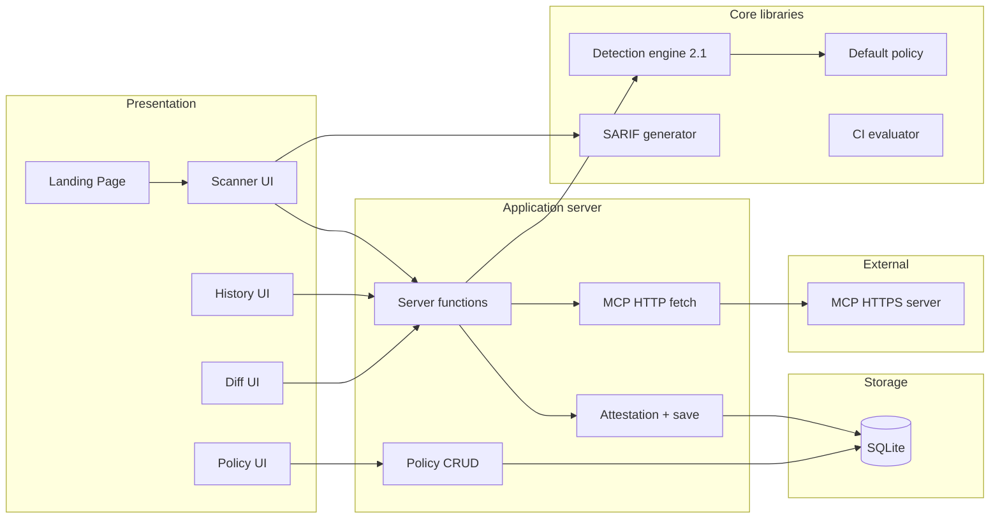
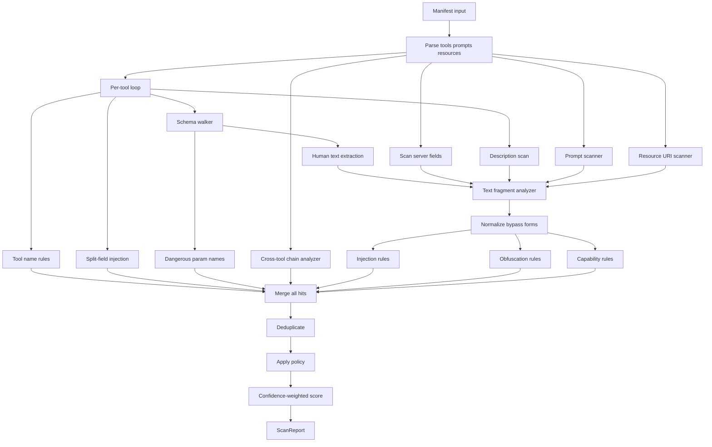

# Linejump — Technical Documentation

**By:** Ritvik Indupuri  
**Date:** Jun 18, 2026

---

## Table of contents

1. [Executive summary](#executive-summary)
2. [Product scope](#product-scope)
3. [System architecture](#system-architecture)
4. [Detection engine architecture](#detection-engine-architecture)
5. [Core features](#core-features)
6. [Data model and persistence](#data-model-and-persistence)
7. [API and server functions](#api-and-server-functions)
8. [CLI and transports](#cli-and-transports)
9. [Policy system](#policy-system)
10. [Scoring model](#scoring-model)
11. [Export formats](#export-formats)
12. [CI integration](#ci-integration)
13. [Security considerations](#security-considerations)
14. [Deployment](#deployment)
15. [Testing](#testing)
16. [Conclusion](#conclusion)

---

## Executive summary

Linejump is a **pre-flight static analysis platform** for Model Context Protocol (MCP) servers. Organizations use it to audit tool manifests, descriptions, and schemas before those definitions reach LLM context windows or production agent pipelines.

Unlike runtime MCP proxies, Linejump operates on **declared metadata** — the same surface area a model sees when selecting tools. The detection engine (v2.1) applies deterministic rules for prompt injection, obfuscation, capability risk, schema analysis, and cross-tool exfiltration chains. Findings carry stable rule IDs for enterprise policy tuning.

The application ships as a **web scanner** (TanStack Start + React), a **CLI** for CI and local stdio MCP servers, and **SQLite-backed** scan history with policy storage. Exports include **SARIF 2.1.0** for GitHub Advanced Security, PDF for audits, and JSON for automation.

Linejump does **not** use autonomous LLM agents for detection. The engine is fully rule-based, reproducible, and offline-capable.

---

## Product scope

### In scope

| Capability | Description |
|------------|-------------|
| Static manifest analysis | Tools, descriptions, input schemas |
| Prompt & resource scanning | MCP prompts array, resource URIs |
| Server-level fields | instructions, systemPrompt, serverInfo |
| Live HTTPS fetch | GET JSON or MCP `tools/list` |
| Local / stdio MCP | CLI-only process spawn |
| Policy per organization | Disable rules, override severity |
| Scan history & diff | SQLite persistence, side-by-side compare |
| SARIF / PDF / JSON export | CI and human workflows |

### Out of scope (current version)

| Capability | Notes |
|------------|-------|
| Runtime tool execution | No dynamic fuzzing or invocation |
| LLM semantic analysis | Deterministic rules only |
| Multi-tenant auth / SSO | Single `default_org` today |
| Web stdio spawn | Browser cannot launch local processes |
| Fleet-wide dashboard | History is single-instance SQLite |

---

## System architecture

<p align="center"><strong>Figure 1 — Linejump system architecture</strong></p>



### Component descriptions

| Component | Path | Role |
|-----------|------|------|
| Landing page | `src/routes/index.tsx` | Marketing, product overview |
| Scanner | `src/routes/app.tsx` | Primary scan UX, ATLAS, exports |
| Policy | `src/routes/policy.tsx` | Org policy editor |
| History | `src/routes/history.tsx` | Scan list, diff selection |
| Diff | `src/routes/diff.tsx` | Two-scan comparison |
| MCP fetch | `src/lib/mcp-fetch.functions.ts` | HTTPS manifest retrieval |
| MCP stdio | `src/lib/mcp-stdio.ts` | CLI stdio handshake |
| Detection engine | `src/lib/detection/engine.ts` | All scan rules |
| Scanner API | `src/lib/mcp-scanner.ts` | Public scan + parse API |
| Database | `src/lib/db.ts` | SQLite schema + queries |
| SARIF | `src/lib/sarif.ts` | SARIF 2.1.0 export |
| CLI | `cli/scan.ts` | Headless scanning |

### Request lifecycle (web scan)

1. User submits manifest or URL from `src/routes/app.tsx`.
2. `fetchPolicy` loads org policy; `mergePolicy` applies defaults.
3. For URL: `fetchMcpManifest` validates host (no private IPs), fetches JSON or RPC.
4. `parseManifestInput` normalizes JSON shapes (manifest, tools/list, array).
5. `scanManifest` → `runDetectionEngine` produces findings + score + coverage.
6. `generateSignedReport` signs report, saves scan to SQLite, returns scan ID.
7. UI renders ATLAS map, findings, score tooltip, export buttons.

---

## Detection engine architecture

<p align="center"><strong>Figure 2 — Detection engine pipeline</strong></p>



### Normalization layer

`src/lib/detection/normalize.ts` applies transforms before pattern matching:

- Unicode NFKC normalization
- Homoglyph folding (Cyrillic → Latin)
- Leetspeak expansion
- Zero-width character removal
- Punctuation stripping between tokens
- Spaced-letter collapse (`i g n o r e` → `ignore`)

### Split-field detection

Attackers may split injection phrases across `description` and `inputSchema` fields so per-field scanners miss them. `scanSplitFieldInjection` joins normalized fragments and flags phrases/patterns that only match combined text.

### Rule categories

See [Rule Catalog](./rule-catalog.md) for the complete ID list. Categories: injection, obfuscation, capability, schema, cross-tool chains, tool shadowing, resources, manifest.

### Engine version

`ENGINE_VERSION` in `src/lib/detection/engine.ts` (currently **2.1.0**) is stamped on every `ScanReport` as `engineVersion` and `coverage.rulesVersion`.

---

## Core features

### 1. Web scanner (`/app`)

- Paste JSON or fetch HTTPS MCP endpoint
- Real-time scan via server-side engine (no third-party API)
- ATLAS attack-landscape map (`src/components/atlas-map.tsx`)
- Safety score with explanatory tooltip
- Finding cards: severity, category, ruleId, confidence, location, evidence
- SARIF and PDF download after scan completes

### 2. Live MCP HTTP fetch

`fetchMcpManifest` (`src/lib/mcp-fetch.functions.ts`):

1. Validates URL (HTTPS only, blocks localhost/private ranges)
2. Attempts GET for static JSON
3. Falls back to JSON-RPC `tools/list` with SSE parsing
4. Returns normalized manifest string

### 3. Detection engine

40+ rules across injection, obfuscation, capabilities, schema, chains. Context-aware capability matching reduces false positives on standard tool names (`read_file`, etc.).

### 4. Policy system

- `disabledRules` — filter by rule ID
- `severityOverrides` — per-rule severity
- `blockedCapabilities` — keyword escalation to critical
- `customRegexes` — org-specific patterns
- Defaults in `src/lib/default-policy.ts`

### 5. Scan history

- Stored in `scans` table with manifest + report JSON
- History UI lists scans with score and timestamp
- Select two scans → diff view

### 6. Diff view

- Side-by-side findings from two scan IDs
- Query params: `?id1=&id2=`

### 7. Attestation

- RSA-SHA256 sign of report payload (`src/lib/attestation.ts`)
- Demo-grade ephemeral keys (production should use KMS)
- Scan ID generated per run

### 8. CLI

`cli/scan.ts` supports file, URL, stdin, `--stdio`, `--mcp-config`, `--json`, `--sarif`, `--ci`, `--policy`.

### 9. CI evaluator

`src/lib/ci-check.ts` — threshold checks on critical/high/medium counts and min score; markdown output for pipelines.

### 10. SARIF export

`src/lib/sarif.ts` — SARIF 2.1.0 with driver rules, results, safety score properties. Compatible with GitHub code scanning upload.

---

## Data model and persistence

SQLite database: `linejump.sqlite`

### Tables

**orgs**

| Column | Type | Description |
|--------|------|-------------|
| id | TEXT PK | Organization ID (`default_org`) |
| name | TEXT | Display name |

**policies**

| Column | Type | Description |
|--------|------|-------------|
| org_id | TEXT PK | FK to orgs |
| config_json | TEXT | Serialized `ScannerPolicy` |

**scans**

| Column | Type | Description |
|--------|------|-------------|
| id | TEXT PK | Random scan ID |
| org_id | TEXT | FK to orgs |
| server_url | TEXT | Source URL if any |
| manifest_json | TEXT | Input manifest |
| report_json | TEXT | Full `ScanReport` |
| created_at | DATETIME | Timestamp |

---

## API and server functions

| Function | File | Method | Purpose |
|----------|------|--------|---------|
| `fetchMcpManifest` | `mcp-fetch.functions.ts` | POST | HTTPS manifest fetch |
| `fetchPolicy` | `policy.functions.ts` | GET | Load merged policy |
| `savePolicyFn` | `policy.functions.ts` | POST | Save org policy |
| `generateSignedReport` | `attestation.functions.ts` | POST | Sign + persist scan |
| `fetchHistory` | `db.functions.ts` | GET | List scans |
| `fetchScan` | `db.functions.ts` | GET | Single scan by ID |

---

## CLI and transports

| Transport | Web | CLI | Implementation |
|-----------|-----|-----|----------------|
| Pasted JSON | ✓ | ✓ | `parseManifestInput` |
| HTTPS URL | ✓ | ✓ | `fetch` / `fetchMcpManifest` |
| Local file | — | ✓ | `fs.readFileSync` |
| stdin | — | ✓ | `-` argument |
| stdio MCP | — | ✓ | `mcp-stdio.ts` |
| MCP config JSON | — | ✓ | `--mcp-config` + `--server` |

Stdio handshake sequence:

1. Spawn child process with `command` + `args`
2. Send `initialize` JSON-RPC
3. Send `notifications/initialized`
4. Send `tools/list`
5. Parse JSON lines from stdout → build manifest

---

## Policy system

Policy merge order (`mergePolicy` in `mcp-scanner.ts`):

1. `DEFAULT_SCANNER_POLICY` base
2. Organization policy from DB or CLI file
3. `severityOverrides` shallow-merged (org wins)

See [Tuning Guide](./tuning-guide.md) for enterprise scenarios.

---

## Scoring model

```
penalty = Σ (SEVERITY_WEIGHT[sev] × CONFIDENCE_MULTIPLIER[conf])
score = clamp(100 - penalty, 0, 100)
```

- One penalty per unique `(toolName, ruleId)` pair
- Low-confidence findings reduce score impact
- Info findings do not penalize

---

## Export formats

### SARIF 2.1.0

- CLI: `npm run scan -- ./manifest.json --sarif out.sarif.json`
- Web: **Download SARIF** button on scanner
- Maps critical/high → error, medium → warning, low/info → note

### PDF

- Client-side jsPDF generation
- Server name, scan ID, score, top 20 findings

### JSON

- Full `ScanReport` including `coverage` metadata
- CLI: `--json`

---

## CI integration

```bash
npm run scan -- ./manifest.json --ci \
  --max-critical=0 \
  --max-high=0 \
  --min-score=70
```

Exit code `1` on threshold failure.

**GitHub Actions + SARIF:**

```yaml
- run: npm run scan -- ./mcp.json --sarif linejump.sarif.json --ci
- uses: github/codeql-action/upload-sarif@v3
  with:
    sarif_file: linejump.sarif.json
```

---

## Security considerations

| Topic | Mitigation |
|-------|------------|
| SSRF on URL fetch | HTTPS only; block private IP ranges |
| Stdio spawn (CLI) | User explicitly provides command — runs with user permissions |
| SQLite | Local file; no network exposure |
| Signing keys | Ephemeral RSA per process — replace with KMS for production |
| Data privacy | Scans run locally; no manifest sent to external AI APIs |

---

## Deployment

### Docker

```bash
docker compose up --build
```

- Port **3000**
- Volume `linejump-data` for SQLite persistence
- Bun runtime in container

### Manual

```bash
npm install
npm run build
npm run preview
```

---

## Testing

```bash
npm test
```

| Suite | File | Coverage |
|-------|------|----------|
| Detection engine | `src/lib/detection/engine.test.ts` | Rules, split-field, policy, false positives |
| SARIF | `src/lib/sarif.test.ts` | SARIF structure validation |

---

## Conclusion

Linejump provides a **deterministic, policy-tunable, CI-ready** static analysis layer for MCP server manifests. The architecture separates presentation (React UI, CLI), application services (server functions, fetch, persistence), and core detection (rule engine with normalization and split-field analysis).

For enterprises, the recommended deployment pattern is:

1. **CI gate** — `npm run scan -- --ci --sarif` on every manifest change
2. **Policy tuning** — start with defaults, disable noisy rules per org ([Tuning Guide](./tuning-guide.md))
3. **Human review** — web scanner + PDF for vendor approval workflows
4. **Complement runtime controls** — Linejump is SAST, not a substitute for execution sandboxing

Future enhancements (not in current release): multi-tenant auth, KMS signing, fleet dashboard, optional LLM-assisted review for ambiguous findings.

---

## Related documents

- [Rule Catalog](./rule-catalog.md)
- [Tuning Guide](./tuning-guide.md)
- [README](../README.md)
